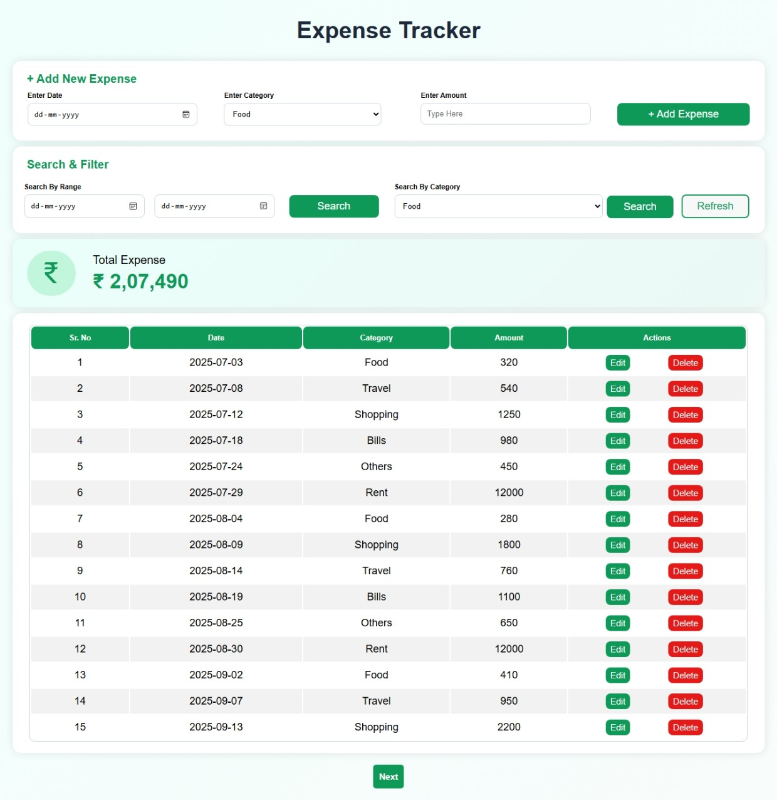

Project Name :- Expense Tracker

Description :- this is expense tracker website which is use to track daily/monthly/yearly expense by different categories

Features :- track expenses , filter by category or between two dates

Open This Project :- https://webtest3035.github.io/expenseTracker/

Language Used :- HTML, CSS, JavaScript

Image :- 

;
